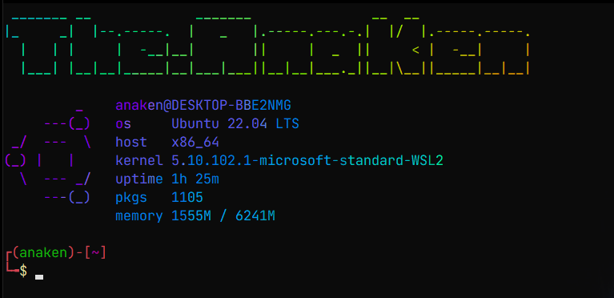

# Contents

-   [About](#utility-files)
-   [Installation](#Installation)
-   [Languages](#languages)
    -   [Js](#js)
    -   [Shell](#shell)
-   [Dependencies Required](#dependencies-required)
-   [Zshell ScreenShot](#the-zshell-look-after-using-zshrczshrczshrc)
-   [Support Email](#support)

# Utility Files

A repo consisting of utility functions/ files which comes to use time to time

## Installation

### Clone it using git

```bash
git clone https://github.com/theAnaKen/utility-funtions.git &&
cd utility-funtions/
```

### Install figlet fonts

[GitHub](https://github.com/xero/figlet-fonts.git)

```bash
git clone https://github.com/xero/figlet-fonts.git
cd figlet-fonts
sudo mv * /usr/share/figlet/
cd ..
rm -rf figlet-fonts
```

## Languages

-   ### Js
    -   limit decimal digits
    -   remove comma from a string
    -   remove extra spaces from a string
-   ### Shell
    -   zshrc

### Dependencies required

-   lolcat
-   pfetch
-   figlet
-   zsh
-   zsh-syntax-highlighting
-   zsh-autosuggestions

## The Zshell look after using [zshrc](zshrc/zshrc)



## try Zshell

```bash
zsh
```

## Change your default shell to zsh (linux)

```bash
chsh
*input root password*
/bin/zsh
*reboot system*
```

### Change figlet Text art

change the name variable in [zshrc](zshrc/zshrc) at line 1

## Support

For support, email the.anaken@gmail.com .
